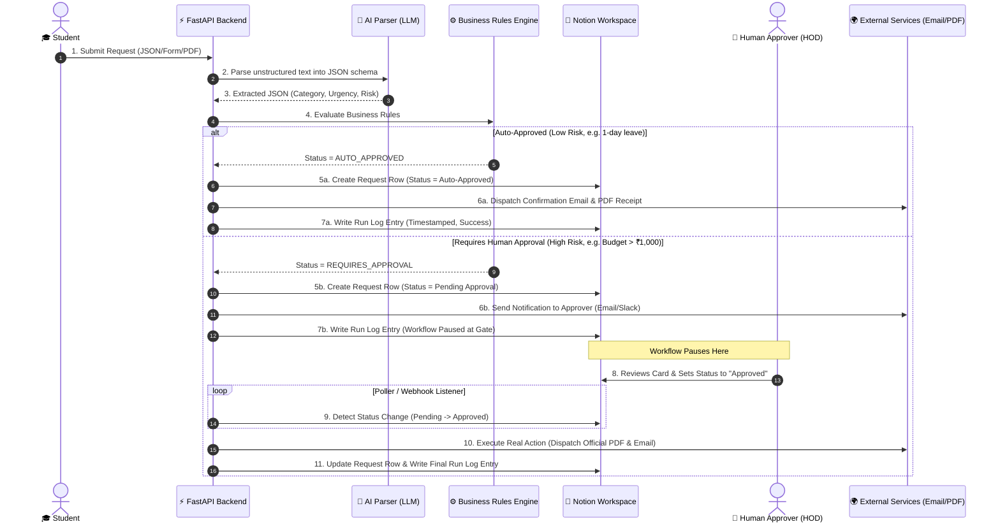

# Architecture.md — System Architecture & Data Flow
## CampusDesk AI: Autonomous Student Request & Approval Engine

---

## 1. System Overview & Core Philosophy
CampusDesk AI separates the **Engine** (Backend Code) from the **Control Panel** (Notion Interface) and the **Real-World Action Layer** (Email, PDF Generation, Webhooks).

```
   +-----------------------------------------------------------------------------------+
   |                                  EXTERNAL WORLD                                   |
   |                                                                                   |
   |   [Student Input] -----> [Webhook Ingestion API]                                  |
   |                                   |                                               |
   |                                   v                                               |
   |                         +-------------------+                                     |
   |                         |  FASTAPI BACKEND  |                                     |
   |                         |  (Python Engine)  |                                     |
   |                         +---------+---------+                                     |
   |                                   |                                               |
   |             +---------------------+---------------------+                         |
   |             |                                           |                         |
   |             v                                           v                         |
   |    [External Actions]                         [Notion Integration]                |
   |    - Resend / SMTP Email                      - Requests DB Sync                  |
   |    - ReportLab PDF Generation                 - Human Approval Gate               |
   |    - Webhook Dispatches                       - Programmatic Run Log              |
   +-----------------------------------------------------------------------------------+
```

---

## 2. End-to-End System Sequence Diagram



---

## 3. Component Architecture Breakdown

### 3.1 Ingestion Layer (`src/ingestion/`)
* **`webhook_listener.py`**: Exposes HTTP endpoints (`/api/v1/requests/submit`) accepting `multipart/form-data` (PDFs, images) or `application/json`.
* **`idempotency.py`**: Generates SHA-256 request hashes to guarantee zero duplicate submissions.

### 3.2 Parsing & Logic Layer (`src/core/`)
* **`ai_parser.py`**: Uses Pydantic structured output models (`Instructor` / `Google GenAI SDK`) to turn raw unstructured strings into validated Python objects.
* **`rule_evaluator.py`**: Applies deterministic code logic:
  ```python
  def evaluate_request(request: StudentRequest) -> WorkflowDecision:
      if request.category == "BUDGET" and request.amount > 1000:
          return WorkflowDecision(requires_human=True, reason="Budget exceeds auto-approval threshold ₹1000")
      if request.category == "LEAVE" and request.days <= 1:
          return WorkflowDecision(requires_human=False, reason="Single day leave auto-approved")
      return WorkflowDecision(requires_human=True, reason="Default security policy")
  ```

### 3.3 Notion Synchronization Layer (`src/notion/`)
* **`notion_client.py`**: Asynchronous HTTP wrapper around Notion REST API (`https://api.notion.com/v1`).
* **`formatter.py`**: Formats request details into human-friendly Notion Page blocks (callout boxes, toggle lists, priority tags) avoiding raw JSON dumps.
* **`poller.py`**: Background task polling Notion database for status transitions (`Pending Approval` $\rightarrow$ `Approved` / `Rejected`).

### 3.4 Action Dispatcher Layer (`src/actions/`)
* **`pdf_generator.py`**: Uses ReportLab to dynamically generate official PDF approval certificates.
* **`email_sender.py`**: Dispatches HTML/PDF emails via SMTP/Resend API.

---

## 4. Notion Workspace Structure

CampusDesk AI maintains 3 tightly linked databases inside the Notion Workspace:

1. 📂 **Student Requests Database**
   - Columns: `Request ID` (Title), `Student Name` (Text), `Category` (Select), `Urgency` (Select), `Status` (Select: Draft, Pending Approval, Approved, Rejected, Completed), `AI Reasoning Summary` (Text), `Submission Timestamp` (Date).
2. 🙋 **Human Approvals Queue View**
   - Filtered view showing only rows where `Status == Pending Approval`.
   - Approvers review summary cards and toggle status directly.
3. 📗 **System Run Log Database**
   - Columns: `Run ID` (Title), `Request Ref` (Relation), `Trigger Source` (Select), `Action Taken` (Text), `Execution Time (ms)` (Number), `Timestamp` (Date), `Success` (Checkbox).

---

## 5. Technology Stack Summary
* **Language & Runtime:** Python 3.11+
* **Web Framework:** FastAPI + Uvicorn
* **Database & Control Panel:** Notion API (v2022-06-28)
* **AI Model:** Gemini 1.5 Flash / OpenAI GPT-4o-mini (Structured Outputs)
* **Document Generation:** ReportLab (Python PDF library)
* **Email Dispatch:** Resend API / Standard SMTP
